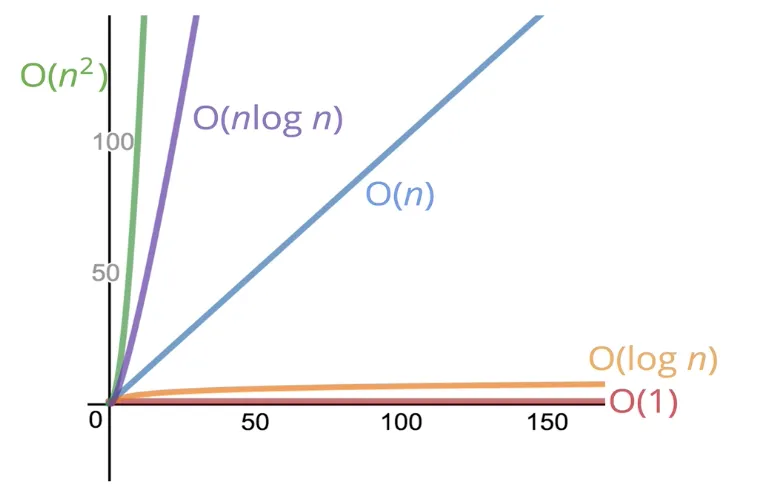

# What is Big O notation?

Big O Notation is one of the most necessary mathematical notations used in computer science to measure an algorithm's efficiency. We can analyze how efficient an algorithm is from the amount of time, storage, other resources it takes to run the algorithm, and a change in the input size. Big O Notation in Data Structure tells us how well an algorithm will perform in a particular situation. In other words, it gives an algorithm's upper-bound runtime or worst-case complexity.

Big O Notation is a fundamental tool used to find out the time complexity of algorithms. Big O Notation allows programmers to classify algorithms depending on how their run time or space requirements vary as the input size varies.

Big O Notation in Data Structure is used to express algorithmic complexity using algebraic terms. It describes the upper bound of an algorithm's runtime and calculates the time and amount of memory needed to execute the algorithm for an input value.

It’s the way of describing the relationship between the input of a function as it grows and how that changes the runtime of that function, it allows us to talk formally about how the runtime of an algorithm grows as the input grows.

#### Constant time O(1):

An algorithm is said to run in constant time if it requires the same amount of time regardless of the input size.

#### Linear time O(n):

An algorithm is said to run in linear time if as the input (n) grows, the runtime grows relative to (n).

# Mathematical Definition

Consider the functions f(n) and g(n), where functions f and g are defined on an unbounded set of positive real numbers. g(n) is strictly positive for every large value of n.

The function f is said to be O(g) (read as big- oh of g), if, for a constant c>0 and a natural number n0, f (n) ≤ CG(n) for all n >= n0
This can be written as:

f(n) = O(g(n)), where n tends to infinity (n → ∞)

We can simply write the above expression as:

f(n) = O(g(n))

# Properties of Big O Notation

The most important properties of Big O Notation in Data Structure are:

#### Constant Multiplication:

    If f(n) = CG(n), then O(f(n)) = O(g(n)) for a constant c > 0

#### Summation Function:

    If f(n) = f1(n) + f2(n) + -- + FM(n) and fi(n)≤ fi+1(n) ∀ i=1, 2, --, m,

    then O(f(n)) = O(max(f1(n), f2(n), --, fm(n)))

#### Logarithmic Function:

    If f(n) = log an and g(n)=log bn, then

    O(f(n)) = O(g(n))

#### Polynomial Function:

    If f(n) = a0 + a1.n + a2.n2 + -- + am.nm, then

    O(f(n)) = O(nm)

# How Does Big O Notation Make a Runtime Analysis of an Algorithm?

In order to analyze and calculate an algorithm's performance, we must calculate and compare the worst-case runtime complexities of the algorithm. The order of O(1) - known as the Constant Running Time - is the fastest running time for an algorithm, with the time taken by the algorithm being equal for different input sizes. Although the Constant Running Time is the ideal runtime for an algorithm, it can be rarely achieved because the runtime depends on the size of n inputted.

For example, runtime analysis of an algorithm for a size of n = 20:

    n=20,

    log (20) = 2.996

    20 = 20

    20 log (20) = 59.9

    20^2 = 400

    2^20 = 1084576

    20! = 2.432902 + 1818

Runtime complexity of some common algorithmic examples:
Runtime Complexity for Linear Search – O(n)
Runtime Complexity for Binary Search – O(log n)
Runtime Complexity for Bubble Sort, Insertion Sort, Selection Sort, Bucket Sort - O(n^c).
Runtime Complexity for Exponential algorithms like Tower of Hanoi - O(c^n).
Runtime Complexity for Heap Sort, Merge Sort - O(n log n).
